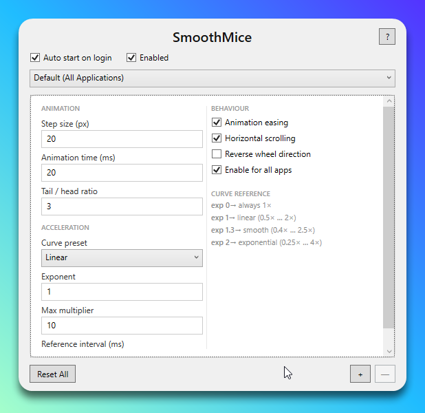

# SmoothMice

Windows-only desktop utility that smooths mouse wheel scrolling with per-application profiles, system tray controls, and JSON settings under `%AppData%\SmoothMice\settings.json`.

## App preview (my profile)



## Requirements

- Windows 10/11 x64
- [.NET 8 SDK](https://dotnet.microsoft.com/download/dotnet/8.0) (for `dotnet build` / `dotnet publish`)

### Optional: install SDK + Inno via winget

```powershell
winget install --id Microsoft.DotNet.SDK.8 -e --accept-package-agreements --accept-source-agreements
winget install --id JRSoftware.InnoSetup -e --accept-package-agreements --accept-source-agreements
```

Inno may install under `%LocalAppData%\Programs\Inno Setup 6\`; [installer/build-installer.ps1](installer/build-installer.ps1) checks that path first.

## Build

```bash
dotnet build SmoothMice.sln -c Release
```

Run the WPF app:

```bash
dotnet run --project src/SmoothMice.App/SmoothMice.App.csproj -c Release
```

Self-contained publish (for installer payload):

```bash
dotnet publish src/SmoothMice.App/SmoothMice.App.csproj -c Release -r win-x64 --self-contained true /p:PublishSingleFile=true
```

Published binaries default to `src/SmoothMice.App/bin/Release/net8.0-windows/win-x64/publish/`.

## Tests

```bash
dotnet test SmoothMice.sln -c Release
```

## Manual smoke tests (recommended)

1. Launch the app, confirm defaults match your baseline profile.
2. Toggle **Enabled** off: wheel should behave like Windows default (no interception).
3. Toggle **Enabled** on: scrolling in Explorer/Chrome/VS Code should feel smoothed.
4. **Horizontal wheel** (trackpad / tilt wheel): when **Horizontal scrolling** is on, horizontal deltas should smooth.
5. Create an app-specific profile and verify it overrides the global profile for that executable.
6. **Auto start on login**: verify `HKCU\Software\Microsoft\Windows\CurrentVersion\Run\SmoothMice` points to the installed `SmoothMice.exe`.
7. Tray menu: Open / Enable-Disable / Exit.

## Installer (Inno Setup 6)

1. Install [Inno Setup 6](https://jrsoftware.org/isdl.php) (includes `ISCC.exe`).
2. From the repo root:

```powershell
.\installer\build-installer.ps1
```

Or double-click `installer\build-installer.cmd` (opens a window; pauses at the end).

**Default publish (small installer, ~99% smaller than self-contained):** framework-dependent, single-file `SmoothMice.exe` (~0.2 MB). The target PC must have **[.NET 8 Desktop Runtime (x64)](https://dotnet.microsoft.com/download/dotnet/8.0)** installed (pick “Desktop Runtime”, not only “Runtime”).

**Portable / offline machine (large exe ~70 MB):** bundle the .NET runtime into the executable:

```powershell
.\installer\build-installer.ps1 -SelfContained
```

Output: `artifacts\installer\SmoothMice_Setup_0.1.0.exe` (version matches `#define MyAppVersion` in [installer/SmoothMice.Installer.iss](installer/SmoothMice.Installer.iss)).

Manual steps: `dotnet publish` as in [installer/build-installer.ps1](installer/build-installer.ps1), then run `ISCC.exe installer\SmoothMice.Installer.iss`.

## Repository

Source: https://github.com/luingry/smoothmice

## Notes

- Low-level mouse hooks require the app to keep running; keep CPU usage low by design.
- Some applications handle wheel messages uniquely; report odd cases as issues.
