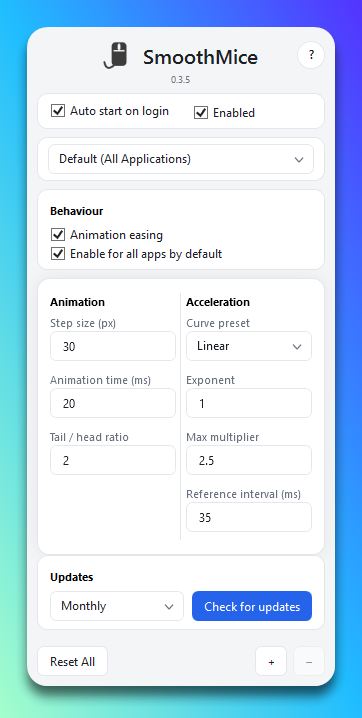

# SmoothMice

Windows-only desktop utility that smooths mouse wheel scrolling with per-application profiles, system tray controls, and JSON settings under `%AppData%\SmoothMice\settings.json`.

**Open source:** the full source is on GitHub. Anyone can **fork** the repo, **edit** the code, and ship **their own build** or forked variant (respect the license file in the repository). Pull requests and issues are welcome if you want changes upstream.

## App preview

<p align="center">
  
</p>

## Requirements

- Windows 10/11 x64
- [.NET 8 SDK](https://dotnet.microsoft.com/download/dotnet/8.0) (for `dotnet build` / `dotnet publish`)

### Optional: install SDK + Inno via winget

```powershell
winget install --id Microsoft.DotNet.SDK.8 -e --accept-package-agreements --accept-source-agreements
winget install --id JRSoftware.InnoSetup -e --accept-package-agreements --accept-source-agreements
```

Inno may install under `%LocalAppData%\Programs\Inno Setup 6\`; [installer/build-installer.ps1](installer/build-installer.ps1) checks that path first.

## Build

```bash
dotnet build SmoothMice.sln -c Release
```

Run the WPF app:

```bash
dotnet run --project src/SmoothMice.App/SmoothMice.App.csproj -c Release
```

Self-contained publish (for installer payload). In Git Bash, prefer explicit MSBuild properties (`--self-contained true` alone can miss bundling the runtime):

```bash
dotnet publish src/SmoothMice.App/SmoothMice.App.csproj -c Release -r win-x64 -p:SelfContained=true -p:PublishSingleFile=true -p:IncludeNativeLibrariesForSelfExtract=true
```

Published binaries: `src/SmoothMice.App/bin/Release/net8.0-windows/win-x64/publish/SmoothMice-{Version}.exe` (o `{Version}` vem de [Directory.Build.props](Directory.Build.props); o instalador Inno copia-o como `SmoothMice.exe` para `{app}`).

## Tests

```bash
dotnet test SmoothMice.sln -c Release
```

## Manual smoke tests (recommended)

1. Launch the app, confirm defaults match your baseline profile.
2. Toggle **Enabled** off: wheel should behave like Windows default (no interception).
3. Toggle **Enabled** on: scrolling in Explorer/Chrome/VS Code should feel smoothed.
4. **Horizontal wheel** (trackpad / tilt wheel): when **Horizontal scrolling** is on, horizontal deltas should smooth.
5. Create an app-specific profile and verify it overrides the global profile for that executable.
6. **Auto start on login**: verify `HKCU\Software\Microsoft\Windows\CurrentVersion\Run\SmoothMice` points to the installed `SmoothMice.exe`.
7. Tray menu: Open / Enable-Disable / Exit.

## Installer (Inno Setup 6)

1. Install [Inno Setup 6](https://jrsoftware.org/isdl.php) (includes `ISCC.exe`).
2. From the repo root:

```powershell
.\installer\build-installer.ps1
```

Or double-click `installer\build-installer.cmd` (opens a window; pauses at the end).

**Instalador por defeito** (`.\installer\build-installer.ps1`): **self-contained** (`SmoothMice_Setup_*.exe`, ~64 MB), igual ao asset típico de release — sem instalar .NET à parte no PC alvo.

**Instalador leve (framework-dependent):** o payload é o single-file `SmoothMice-{Version}.exe` em `publish\` (~0.2 MB); o alvo precisa de **[.NET 8 Desktop Runtime (x64)](https://dotnet.microsoft.com/download/dotnet/8.0)**. Após instalar, o ficheiro em disco continua `SmoothMice.exe`.

```powershell
.\installer\build-installer.ps1 -FrameworkDependent
```

Output: `artifacts\installer\SmoothMice_Setup_{version}.exe` — o `version` é o MSBuild `Version` em [Directory.Build.props](Directory.Build.props) (o script [installer/build-installer.ps1](installer/build-installer.ps1) passa-o ao Inno). Histórico por versão: [release-notes.md](release-notes.md).

Manual steps: `dotnet publish` as in [installer/build-installer.ps1](installer/build-installer.ps1), then `ISCC.exe /DMyAppVersion=x.y.z /DMyPublishedExe=SmoothMice-x.y.z.exe installer\SmoothMice.Installer.iss` (valores alinhados a `Directory.Build.props`), or use the script.

## Repository

- **Upstream:** https://github.com/luingry/smoothmice  
- **Fork & customize:** use GitHub **Fork**, clone your fork, change whatever you need, then `dotnet build` / `dotnet publish` as below. Your fork is yours to rename, rebrand, or extend — no permission needed beyond the repo license.

## Notes

- Low-level mouse hooks require the app to keep running; keep CPU usage low by design.
- Some applications handle wheel messages uniquely; report odd cases as issues.
