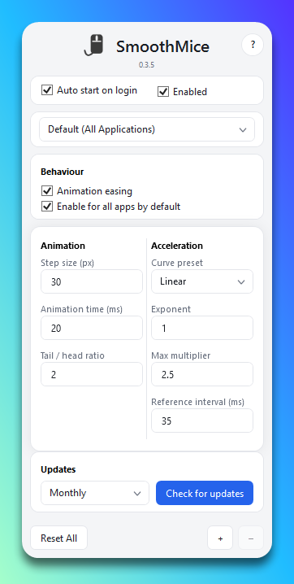

# SmoothMice

Windows-only desktop utility that smooths mouse wheel scrolling with per-application profiles, system tray controls, and JSON settings under `%AppData%\SmoothMice\settings.json`.

**Open source:** the full source is on GitHub. Anyone can **fork** the repo, **edit** the code, and ship **their own build** or forked variant (respect the license file in the repository). Pull requests and issues are welcome if you want changes upstream.

## App preview

<p align="center">
  
</p>

## Requirements

- Windows 10/11 x64
- [.NET 8 SDK](https://dotnet.microsoft.com/download/dotnet/8.0) (for `dotnet build` / `dotnet publish`)

### Optional: install SDK + Inno via winget

```powershell
winget install --id Microsoft.DotNet.SDK.8 -e --accept-package-agreements --accept-source-agreements
winget install --id JRSoftware.InnoSetup -e --accept-package-agreements --accept-source-agreements
```

Inno may install under `%LocalAppData%\Programs\Inno Setup 6\`; [installer/build-installer.ps1](installer/build-installer.ps1) checks that path first.

## Build

```bash
dotnet build SmoothMice.sln -c Release
```

Run the WPF app:

```bash
dotnet run --project src/SmoothMice.App/SmoothMice.App.csproj -c Release
```

Self-contained publish (for installer payload). In Git Bash, prefer explicit MSBuild properties (`--self-contained true` alone can miss bundling the runtime):

```bash
dotnet publish src/SmoothMice.App/SmoothMice.App.csproj -c Release -p:PublishDebugSymbols=false
```

Published binaries: `src/SmoothMice.App/bin/Release/net48/publish/SmoothMice-{Version}.exe` (`{Version}` comes from [Directory.Build.props](Directory.Build.props); the Inno installer copies it as `SmoothMice.exe` into `{app}`).

## Tests

```bash
dotnet test SmoothMice.sln -c Release
```

## Wheel pulse diagnostics

To inspect the raw physical pulses the hook receives, click **Scroll logs** at the bottom of the SmoothMice window. The modeless window shows each pulse live, before smoothing: relative and UTC time, axis, delta/direction, interval since the previous pulse on the same axis, the count within a 120 ms window, and burst/reversal markers.

Use **Clear** to reset rows, totals, and analysis before starting a controlled test. The view keeps at most the 500 most recent pulses; under overload, old pulses or those exceeding the local queue are dropped and the status shows the total. This mode creates no file and does not start the diagnostics writer.

The **Burst** marker appears on every pulse that completes or stays within a window of 4 or more same-axis pulses in 120 ms — so the total shown counts *marked pulses*, not distinct burst episodes. **Reversal** marks a direction change on the same axis within 150 ms. Both are heuristics for finding stretches worth comparing against the wheel's physical movement; on their own they do not prove a hardware defect. Also test in another app, port, or computer before concluding on a cause.

To also persist the same capture as NDJSON, start with:

```powershell
dotnet run --project src/SmoothMice.App/SmoothMice.App.csproj -c Release -- --scroll-log
```

Each run with the option creates one NDJSON file per session in `%LOCALAPPDATA%\SmoothMice\Diagnostics` (for example, `scroll-pulses-...ndjson`). Without `--scroll-log` there is no file and no persistence thread. The file can coexist with the live window; both receive the same physical pulse. Pulses Windows flags as injected (`LLMHF_INJECTED`), including those SmoothMice generates, are excluded before logging.

There is a header line with the thresholds and one line per pulse: `utc` and `monotonic_ticks`, `axis`, `delta`/`direction`, `interval_ms` since the previous pulse on the same axis, `burst_120ms_count`, `short_burst`, `rapid_reversal`, `shift`, and the screen position `x`/`y`. The last line reports `records_written` and `dropped_pulses`. The queue is capped at 4,096 pulses and the file at 100,000 pulse lines; under overload, drops show up in the final summary so the hook is never delayed.

`short_burst` and `rapid_reversal` use the same criteria as the live window.

## Manual smoke tests (recommended)

1. Launch the app, confirm defaults match your baseline profile.
2. Toggle **Enabled** off: wheel should behave like Windows default (no interception).
3. Toggle **Enabled** on: scrolling in Explorer/Chrome/VS Code should feel smoothed.
4. **Horizontal wheel** (trackpad / tilt wheel): when **Horizontal scrolling** is on, horizontal deltas should smooth.
5. Create an app-specific profile and verify it overrides the global profile for that executable.
6. **Auto start on login**: verify `HKCU\Software\Microsoft\Windows\CurrentVersion\Run\SmoothMice` points to the installed `SmoothMice.exe`.
7. Tray menu: Open / Enable-Disable / Exit.

## Installer (Inno Setup 6)

1. Install [Inno Setup 6](https://jrsoftware.org/isdl.php) (includes `ISCC.exe`).
2. From the repo root:

```powershell
.\installer\build-installer.ps1
```

Or double-click `installer\build-installer.cmd` (opens a window; pauses at the end).

**Default installer** (`.\installer\build-installer.ps1`): publishes for **.NET Framework 4.8** without runtime bundling and installs `SmoothMice-{Version}.exe` with the required DLLs. .NET Framework 4.8 ships with Windows 10/11; after install, the file on disk is still `SmoothMice.exe`.

```powershell
.\installer\build-installer.ps1
```

Output: `artifacts\installer\SmoothMice_Setup_{version}.exe` — `version` is the MSBuild `Version` in [Directory.Build.props](Directory.Build.props) (the [installer/build-installer.ps1](installer/build-installer.ps1) script passes it to Inno). Per-version history: [release-notes.md](release-notes.md).

Manual steps: `dotnet publish` as in [installer/build-installer.ps1](installer/build-installer.ps1), then `ISCC.exe /DMyAppVersion=x.y.z /DMyPublishedExe=SmoothMice-x.y.z.exe installer\SmoothMice.Installer.iss` (values matching `Directory.Build.props`), or use the script.

## Repository

- **Upstream:** https://github.com/luingry/smoothmice  
- **Fork & customize:** use GitHub **Fork**, clone your fork, change whatever you need, then `dotnet build` / `dotnet publish` as below. Your fork is yours to rename, rebrand, or extend — no permission needed beyond the repo license.

## Notes

- Low-level mouse hooks require the app to keep running; keep CPU usage low by design.
- Some applications handle wheel messages uniquely; report odd cases as issues.
